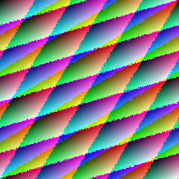
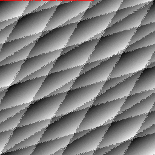

# SteganographyDetector

## Overview

`SteganographyDetector` is a local image-forensics utility focused on least-significant-bit (LSB) steganography. It supports:

- embedding a controlled demo payload into a cover image
- decoding messages from LSB-encoded images that use this format
- comparing a clean cover image against a suspect image to visualize modified pixels
- generating reproducible demo assets for validation

The workflow can be tested end to end with generated sample assets.

## Capabilities

- image-based data hiding with LSB steganography
- structured binary payload handling using a 32-bit length prefix
- cover-vs-stego forensic comparison
- visualization of modified pixels
- reproducible CLI-based validation

## Tech Stack

- Python 3
- Pillow for image loading, pixel access, and output generation
- Standard library: `argparse`, `json`, `struct`, `pathlib`

## Project Structure

```text
SteganographyDetector/
|-- Detector.py
|-- README.md
`-- requirements.txt
```

After running the demo command, a `samples/` folder is generated containing:

- `sample_cover.png`
- `sample_stego.png`
- `sample_overlay.png`

## Sample Images

When the demo workflow is run and the generated samples are committed, GitHub viewers can inspect the baseline image, stego image, and forensic overlay directly:

### Cover Image



### Stego Image


### Overlay Highlighting Modified Pixels



## Requirements

```powershell
python -m pip install -r requirements.txt
```

## Commands

### 1. Generate a full demo set

```powershell
cd D:\Cybersec\SteganographyDetector
python Detector.py demo --output-dir samples
```

This command:

- creates a deterministic cover image
- embeds a hidden message into a stego image
- decodes the message back out
- generates an overlay showing modified pixels
- prints JSON summaries for verification

### 2. Decode a message from an encoded image

```powershell
python Detector.py decode --image samples\sample_stego.png
```

### 3. Compare a cover image with a suspect image

```powershell
python Detector.py compare --cover samples\sample_cover.png --suspect samples\sample_stego.png --output samples\sample_overlay.png
```

### 4. Analyze LSB distribution

```powershell
python Detector.py analyze --image samples\sample_stego.png
```

### 5. Encode a custom message

```powershell
python Detector.py encode --cover samples\sample_cover.png --message "Hidden payload" --output samples\custom_stego.png
```

## How Detection Works

This project uses two complementary ideas:

### Decoding

The tool reads a 32-bit length prefix from the image LSB stream and then extracts the exact number of bits required for the UTF-8 message payload.

### Baseline Comparison

When both the clean cover image and the suspect image are available, the tool compares the RGB least-significant bits channel by channel and produces:

- a changed-pixel count
- a changed-channel count
- a changed-pixel ratio
- an overlay image highlighting modified locations in red

This is more defensible than treating “odd RGB values” alone as evidence of steganography.

## Limitations

- reliable comparison requires the source cover image
- decode mode assumes the image was encoded using this tool’s length-prefixed format
- the analysis command provides heuristics only, not proof of hidden content in arbitrary third-party images
- this is an educational project, not a courtroom-grade forensic suite

## Sample Workflow

1. Run the `demo` command.
2. Commit the generated `samples/` images if desired.
3. Reference the images in the README if the sample assets are included in the repository.
